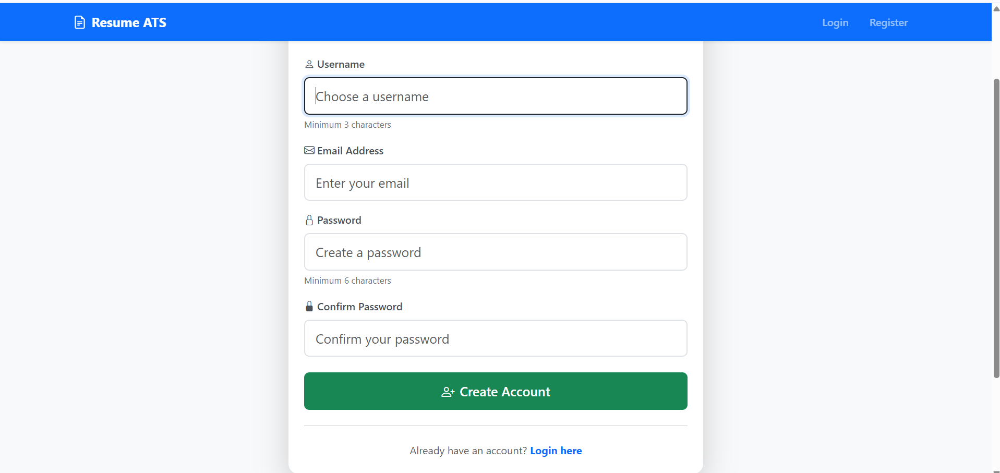
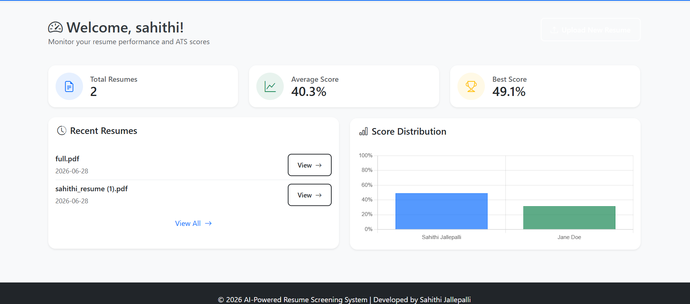
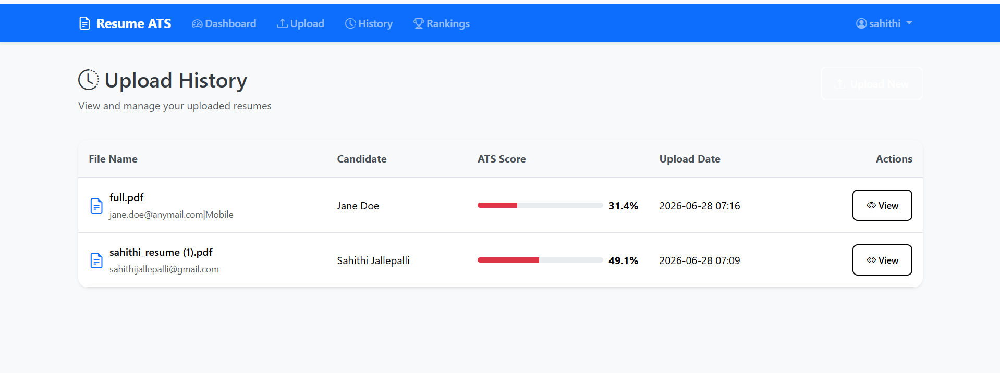
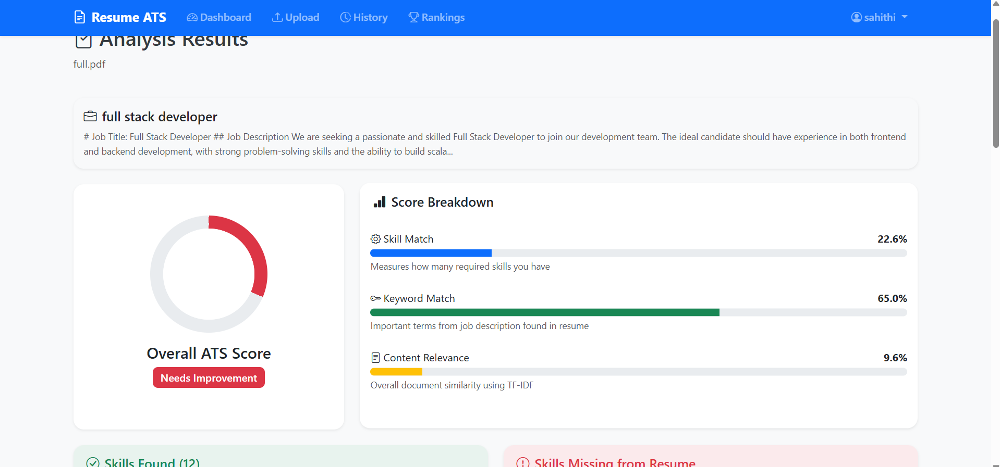
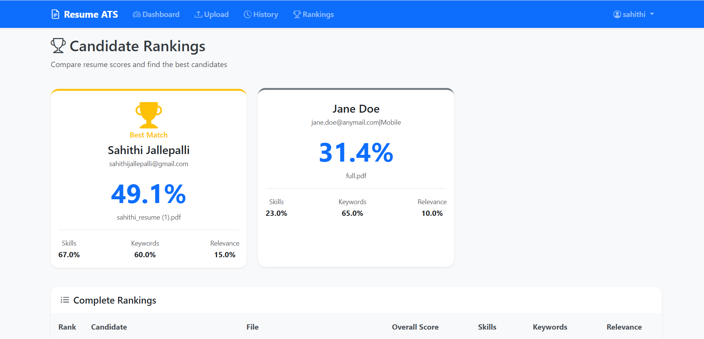

# AI-Powered Resume Screening System

A complete  project for automated resume screening using Natural Language Processing (NLP) and Machine Learning.

## Table of Contents

1. [Project Overview](#project-overview)
2. [Features](#features)
3. [Technology Stack](#technology-stack)
4. [Installation](#installation)
5. [Usage](#usage)
6. [Project Structure](#project-structure)
7. [How It Works](#how-it-works)
8. [Database Schema](#database-schema)
9. [API Endpoints](#api-endpoints)
10. [Project Screenshots](#project-screenshots)
11. [Interview Preparation](#interview-preparation)
12. [Future Enhancements](#future-enhancements)
13. [License](#license)

---

## Project Overview

This AI-Powered Resume Screening System is designed to automate the initial screening process of job applications. It uses Natural Language Processing (NLP) techniques to extract information from resumes (PDF/DOCX formats), calculate ATS (Applicant Tracking System) compatibility scores using TF-IDF and Cosine Similarity, and generate improvement suggestions.


---

## Features

### 1. User Authentication
- User registration with secure password hashing
- Login/logout functionality
- Session management using Flask-Login

### 2. Resume Upload & Parsing
- Support for PDF and DOCX file formats
- File validation (size limit, format check)
- Text extraction using pdfplumber and python-docx

### 3. NLP Processing
- Tokenization and text preprocessing
- Named Entity Recognition (NER)
- Skill extraction using pattern matching
- Keyword extraction for ATS matching

### 4. ATS Score Calculation
- **Skill Match Score**: Compares resume skills with job requirements
- **Keyword Match Score**: Uses TF-IDF for keyword importance
- **Relevance Score**: Overall document similarity using Cosine Similarity
- **Overall ATS Score**: Weighted combination of all scores

### 5. Suggestion Generator
- Identifies missing skills
- Recommends keyword improvements
- Provides formatting suggestions
- Generates ATS optimization tips

### 6. Dashboard & Analytics
- Visual score representation
- Candidate ranking
- Historical data tracking
- Performance charts

---

## Technology Stack

| Category | Technologies |
|----------|-------------|
| Backend | Python 3.x, Flask |
| Database | SQLite |
| NLP | NLTK, spaCy (optional) |
| Machine Learning | Scikit-learn (TF-IDF, Cosine Similarity) |
| Frontend | HTML, CSS, Bootstrap 5, JavaScript |
| File Parsing | pdfplumber, python-docx |
| Authentication | Flask-Login, Werkzeug (password hashing) |
| Charts | Chart.js |

---

## Installation

### Prerequisites
- Python 3.8 or higher
- pip (Python package manager)

### Step 1: Clone or Download the Project

```bash
cd resume_screening_system
```

### Step 2: Create Virtual Environment (Recommended)

```bash
# Create virtual environment
python -m venv venv

# Activate virtual environment
# On Windows:
venv\Scripts\activate
# On Linux/Mac:
source venv/bin/activate
```

### Step 3: Install Dependencies

```bash
pip install -r requirements.txt
```

### Step 4: Download NLTK Data

```python
python -c "import nltk; nltk.download('punkt'); nltk.download('stopwords'); nltk.download('wordnet')"
```

### Step 5: Run the Application

```bash
python app.py
```

### Step 6: Access the Application

Open your browser and navigate to:
```
http://127.0.0.1:5000
```

---

## Usage

1. **Register**: Create a new account
2. **Login**: Access your dashboard
3. **Upload Resume**: Upload a PDF or DOCX file
4. **View Analysis**: See ATS score and suggestions
5. **Improve**: Follow suggestions to improve resume
6. **Compare**: View candidate rankings

---

## Project Structure

```
resume_screening_system/
├── app.py                      # Main Flask application
├── config.py                   # Configuration settings
├── requirements.txt            # Python dependencies
├── README.md                   # This file
│
├── database/
│   ├── init_db.py              # Database initialization
│   └── database.db             # SQLite database (auto-created)
│
├── models/
│   ├── user.py                 # User model
│   ├── resume.py               # Resume model
│   └── ats.py                  # ATS Score model
│
├── routes/
│   ├── auth.py                 # Authentication routes
│   ├── resume_routes.py        # Resume management routes
│   └── dashboard.py            # Dashboard routes
│
├── services/
│   ├── parser.py               # Resume text extraction
│   ├── nlp.py                  # NLP processing
│   ├── ats_calculator.py       # ATS score calculation
│   └── suggestions.py          # Suggestion generator
│
├── templates/
│   ├── base.html               # Base template
│   ├── login.html              # Login page
│   ├── register.html           # Registration page
│   ├── upload.html             # Upload page
│   ├── dashboard.html          # Main dashboard
│   ├── result.html             # Analysis results
│   ├── history.html            # Upload history
│   ├── rankings.html           # Candidate rankings
│   ├── compare.html            # Resume comparison
│   └── profile.html            # User profile
│
├── static/
│   ├── css/
│   │   └── style.css           # Custom styles
│   ├── js/
│   │   └── main.js             # JavaScript functions
│   └── images/                 # Static images
│
└── uploads/                    # Uploaded resumes (auto-created)
```

---
## ⭐ Key Features

- Upload resumes in PDF or DOCX format for automated analysis
- Compare resumes with job descriptions using an ATS-style matching algorithm
- Extract technical skills using Natural Language Processing (NLP)
- Generate resume match scores using TF-IDF and Cosine Similarity
- Provide personalized suggestions to improve resume relevance
- Rank multiple candidates based on job-fit score
- Secure login system with an interactive dashboard
- Developed using Flask, SQLite, Scikit-learn, spaCy, NLTK, HTML, CSS, and JavaScript

## How It Works

### 1. Resume Upload Flow

```
User uploads file → File validation → Save to server → Extract text → Store in DB
```

### 2. NLP Processing Pipeline

```
Raw text → Tokenization → Stopword removal → Lemmatization → Entity extraction → Skill matching
```

### 3. ATS Score Calculation

```
Resume text → TF-IDF Vectorization → Compare with job description → Cosine Similarity → Calculate scores
```

### TF-IDF Explanation

TF-IDF (Term Frequency-Inverse Document Frequency) converts text into numerical vectors:

- **Term Frequency (TF)**: How often a word appears in a document
  ```
  TF(word) = (Count of word in document) / (Total words in document)
  ```

- **Inverse Document Frequency (IDF)**: How rare a word is across documents
  ```
  IDF(word) = log(Total documents / Documents containing word)
  ```

- **TF-IDF Score**: Product of TF and IDF
  ```
  TF-IDF = TF × IDF
  ```
  ## 📸 Project Screenshots

### Login Page


---

### Dashboard


---

### Resume Upload


---

### ATS Analysis Result


---

### Candidate Ranking


### Cosine Similarity

Measures the angle between two document vectors. Range: 0 (completely different) to 1 (identical).

```
Cosine Similarity = (A · B) / (||A|| × ||B||)
```

Where:
- A · B = Dot product of vectors
- ||A|| = Magnitude of vector A

---

## Database Schema

### Users Table
```sql
CREATE TABLE users (
    id INTEGER PRIMARY KEY AUTOINCREMENT,
    username TEXT UNIQUE NOT NULL,
    email TEXT UNIQUE NOT NULL,
    password TEXT NOT NULL,
    created_at DATETIME DEFAULT CURRENT_TIMESTAMP
);
```

### Resumes Table
```sql
CREATE TABLE resumes (
    id INTEGER PRIMARY KEY AUTOINCREMENT,
    user_id INTEGER NOT NULL,
    filename TEXT NOT NULL,
    original_filename TEXT NOT NULL,
    extracted_text TEXT,
    candidate_name TEXT,
    email TEXT,
    phone TEXT,
    skills TEXT,
    education TEXT,
    experience TEXT,
    certifications TEXT,
    projects TEXT,
    upload_date DATETIME DEFAULT CURRENT_TIMESTAMP,
    FOREIGN KEY (user_id) REFERENCES users(id)
);
```
`

### ATS Scores Table
```sql
CREATE TABLE ats_scores (
    id INTEGER PRIMARY KEY AUTOINCREMENT,
    resume_id INTEGER NOT NULL,
    job_id INTEGER,
    skill_match_score REAL DEFAULT 0,
    keyword_match_score REAL DEFAULT 0,
    relevance_score REAL DEFAULT 0,
    overall_ats_score REAL DEFAULT 0,
    calculation_date DATETIME DEFAULT CURRENT_TIMESTAMP,
    FOREIGN KEY (resume_id) REFERENCES resumes(id),
    FOREIGN KEY (job_id) REFERENCES jobs(id)
);
```

---

## API Endpoints

| Endpoint | Method | Description |
|----------|--------|-------------|
| `/` | GET | Redirect to dashboard/login |
| `/auth/login` | GET/POST | User login |
| `/auth/register` | GET/POST | User registration |
| `/auth/logout` | GET | User logout |
| `/resume/upload` | GET/POST | Upload resume |
| `/resume/analyze/<id>` | GET | Analyze resume |
| `/resume/result/<id>` | GET | View results |
| `/resume/history` | GET | Upload history |
| `/resume/delete/<id>` | GET | Delete resume |
| `/dashboard/` | GET | Main dashboard |
| `/dashboard/rankings` | GET | Candidate rankings |
| `/dashboard/profile` | GET | User profile |

---


## Future Enhancements

1. **Advanced NLP**: Integrate BERT for better understanding
2. **OCR Support**: Handle scanned PDFs
3. **Real-time Collaboration**: Multiple users reviewing
4. **API Development**: RESTful API for integration
5. **Machine Learning Classification**: Predict job fit
6. **Mobile App**: Native mobile application
7. **Cloud Deployment**: Deploy on AWS/Azure/GCP

---

## License

This project is created for educational purpose.

---

## Contact

For any queries regarding this project, feel free to reach out.


